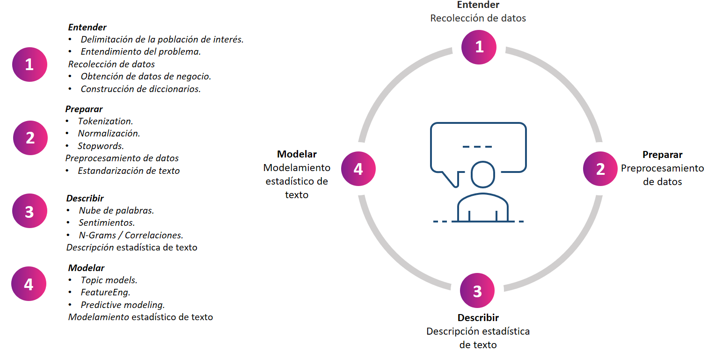

A través de las últimas clases, nos hemos dado cuenta que el análisis de texto representa una gran cantidad de retos y que además tiene una amplia aplicabilidad en diferentes casos de negocio. Adicionalmente, hemos logrado listar 4 diferentes pasos escenciales en el análisis de esta información no estructurada:



Una vez se delimita la población de interés y las diferentes reglas de inclusión y exlusión que dieron origen a los datos textuales y se define cuál de las soluciones es la más apropiada:

1. Descripción textual.
2. Trending topics.
    * Enfoque determinístico.
    * Enfoque probabilístico.
3. Clustering textual.
4. Analisis de sentimiento.
    * Supervisado.
    * No supervisado.
5. Analisis de emociones.
    * Supervisado.
    * No supervisado.
    
Se procede a *preparar* la base de datos textual. El problema de negocio a afrontar es la descripción textual y los trending topics para 50 motivos de cambio de turno de nuestros agentes.

### Paquetes para el análisis de texto

Inicialmente se llaman los paquetes para el análisis textual
```{r}
install.packages("tidytext",dependencies=TRUE)
install.packages("tidyverse",dependencies=TRUE)
library(tidyverse)
library(tidytext)
library(readr)
```

### Lectura de datos
Posteriormente, se leen los datos con un enfoque tidy

```{r}
datos = read_csv("datos_turno.csv")
```
#### Ejercicio #1
En el espacio de abajo, muestre la primera y la última fila de la base de datos textuales

```{r}
#=== Respuesta aquí
```


#### Ejercicio #2
En el espacio de abajo y usando la función ```nchar()```, muestre la distribución del número de caracteres de la variable "Texto". Muestre además el texto más largo y el más corto en términos de sus caracteres
```{r}
#=== Respuesta aquí
```
```{r}
#=== Respuesta aquí
```

Como se puede observar, la distribución de los datos puede determinarse en función del número de caracteres que este contiene. Sin embargo, puede ser más informativo entender el texto como una secuencia de palabras que como una secuencia de caracteres, y para esto se usa la función ```unnest_tokens()```

```{r}
datos_uni = datos %>% unnest_tokens(word,Texto)
head(datos_uni)
```
Note el uso del operador ```%>%```. Esta nueva estructura de texto es mucho más conveniente para manupular la información textual. Fíjese en lo siguiente:

1. Las variables individuales a nivel linea de texto se mantienen
2. Se ha quitado la puntuación (puntos, comas, exclamaciones, entre otros). Esto elimina los emojis.
3. El texto es llevado a minúsculas.

Este formato nos permite contar fácilmente las palabras más frecuentes en el texto:

```{r}
datos_uni %>% count(word,sort=TRUE)
```
Se nota algunas palabras bastantes frecuentes que no tienen mucho valor (por ejemplo: de, por, para, la,...) por lo cual, se deciden retirar dichas palabras. 
```{r}
library(tm)
stop_spa  = tibble(word=stopwords("spanish"))
head(stop_spa)
```
Una de las ventajas de tener el texto en forma estandarizada es la posibilidad de retirar stopwords fácilmente:
```{r}
datos_uni = datos_uni %>% anti_join(stop_spa) 
```
#### Ejercicio #3
Usando la base ```datos_uni```, cuente la frecuencia de cada unigrama y realice un barplot con los 10 más frecuentes.
```{r}
#=== Respuesta aquí
```
Note que exaltan posibles stopwords adicionales (como por ejemplo, "gracias"). Además, existe una clara entidad nombrada de la cual hacen uso los agentes (LNR), sin embargo, puede que otros agentes utilicen las palabras de manera independiente (licencia no remunerada) o de una forma diferente (PNR). Veremos más respecto a este problema en la próxima lección. 

#### Ejercicio #4

Retire la palabra "gracias" del corpus de texto mediante la función ```anti_join()```. Actualice la base ```datos_uni``` con el resultado de retirar esta stopword.
```{r}
#=== Respuesta aquí
```


Otro de los problemas que existen en el texto está basado en las variaciones del lenguaje. se nota que "solicitud" y "solicito" son ambas palabras cuya raiz es "solicitar". Quizá unificar estas palabras pueda mostrar mejor la importancia de esta variable en la distribución de los unigramas. Una metodología para estandarizar aún más el texto es llamada lematización. Considerando un diccionario de lematización, se pueden reemplazar estas palabras por su raíz.

#### Ejercicio #5

Parte 1.Lea la base ```lemmatization-es.txt``` y realice un ```left_join``` entre la base ```datos_uni``` y la base de lematización que acaba de cargar. Posteriormente, cree una nueva columna llamada "Word" en la que tenga la palabra lematizada (si existe), de lo contrario, que tenga la palabra sin lematizar.

Por cuestiones de espacio, la base debe ser descargada directamente de la página:

```{r}
lemma <- 'https://raw.githubusercontent.com/michmech/lemmatization-lists/master/lemmatization-es.txt'
lemma <- read_delim(lemma,delim="\t",col_types = c(col_character(),col_character()),col_names=c("new","word"))
lemma = lemma %>% group_by(word) %>% summarise(new=first(new)) 
```


```{r}
#Parte 1
#=== Respuesta aquí
```
Parte 2. Encuentre la distribución de los unigramas lematizados ¿cómo se diferencia de la distribución sin lematizar? Considere nuevamente tan solo los primeros 10 unigramas.

```{r}
# Parte 2
#=== Respuesta aquí
```
Quiza la lematización de "cita" no resulte muy cómoda visualmente (aunque permite estandarizar frases como: "estoy citado a ..." y "tengo cita en ...")

Como puede notarse la lematización no es perfecta. Pueden haber palabras que en el contexto tienen un significado diferente al que se lematiza en la frase:

1. La palabra "solicito" fue lematizada a "solicitar", y esto le permitió ascender como palabra aún más frecuente. Sin embargo, la palabra "solicitud" no fue lematizada.
2. La palabra "medica" fue lematizada como "medicar". Esto se debe a que los agentes no utilizaron tílde: en lugar de "médica" usaron "medica".

#### Ejercicio #6
Cree su propia base de lematización, en la cual "solicitud" sea lematizado como "solicitar" y que "medica" sea lematizado como "médico" (con tilde). Posteriormente, cree una nueva columna llamada "WORD" en la que tenga la palabra lematizada en la base propia de lematización (si existe), de lo contrario, que muestre la columna "Word".

```{r}
#=== Respuesta aquí
```
Una visualización bastante comun de un conjunto de datos textual se obtiene a partir de una nube de palabras. En esta herramienta gráfica la frecuencia de los unigramas es proporcional al tamaño de cada una de las palabras. A continuación se muestra la nube de palabras para la columna lematizada.

```{r}
install.packages("wordcloud")
library(wordcloud)
datos_lemma_2 %>% count(WORD) %>% with(wordcloud(WORD, n, max.words = 100))
```


